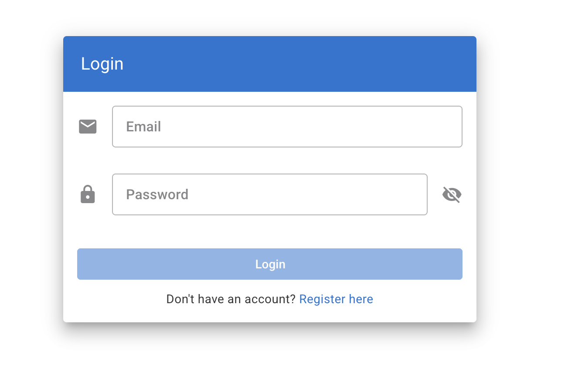
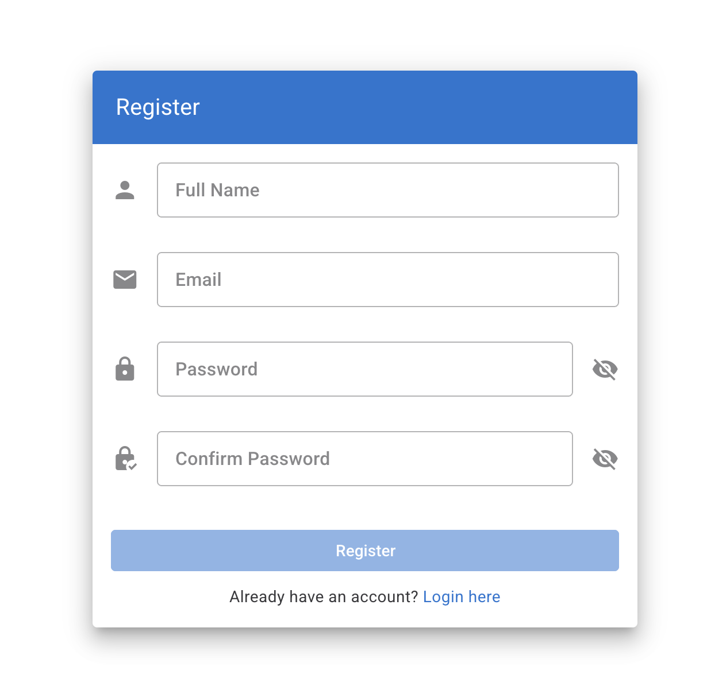
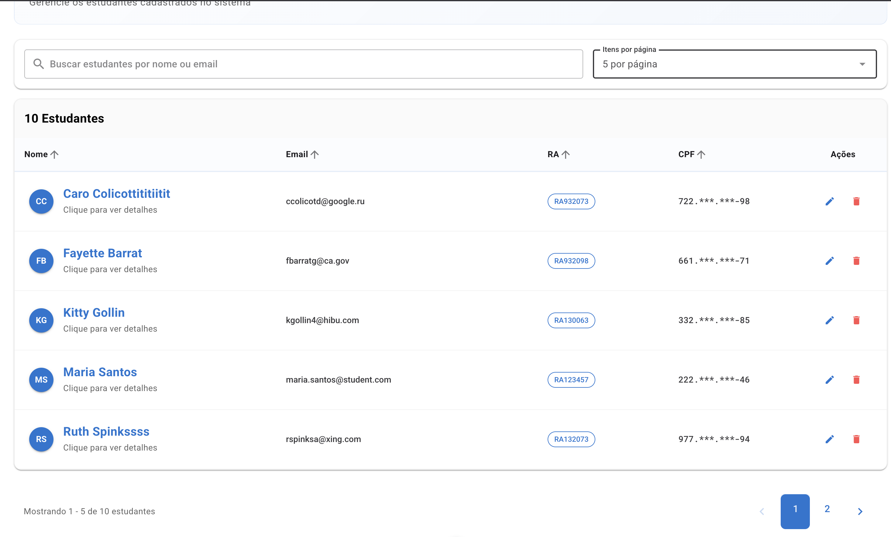
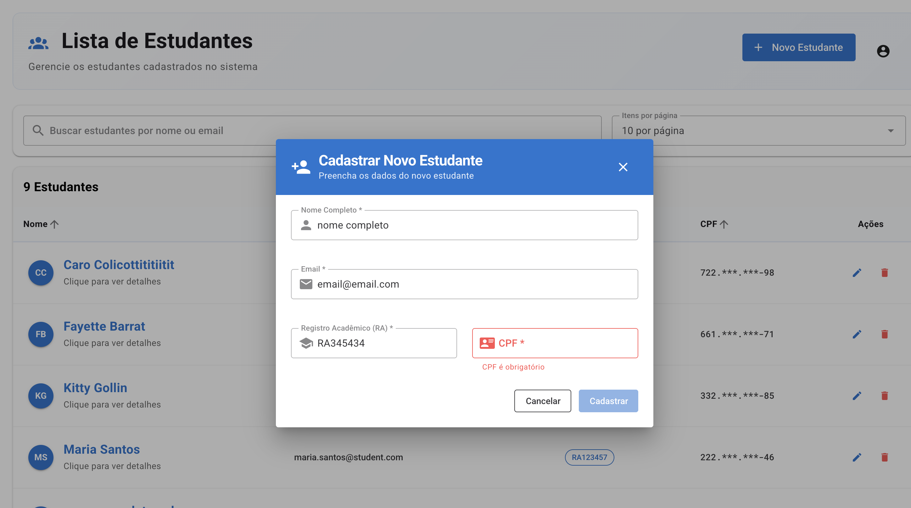
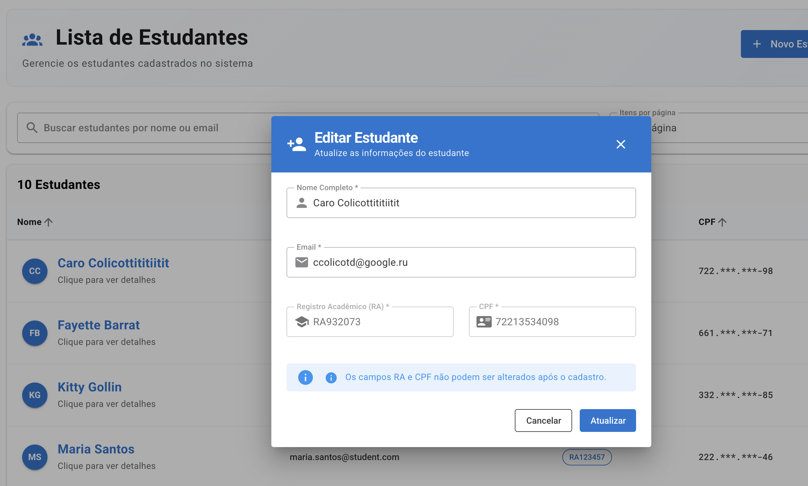
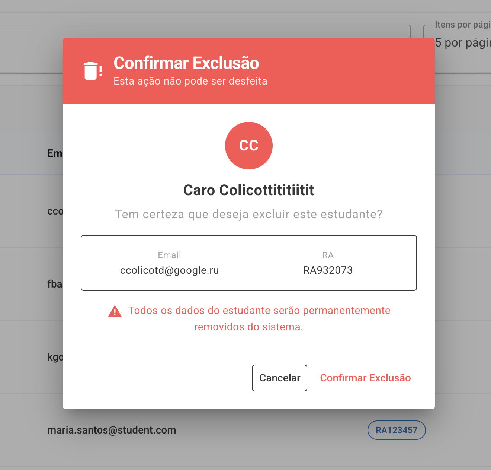
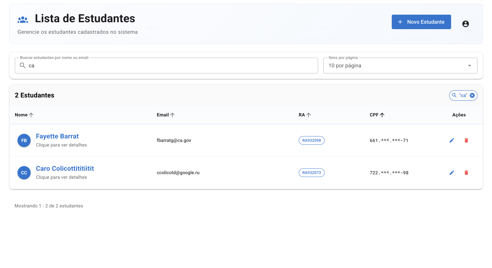
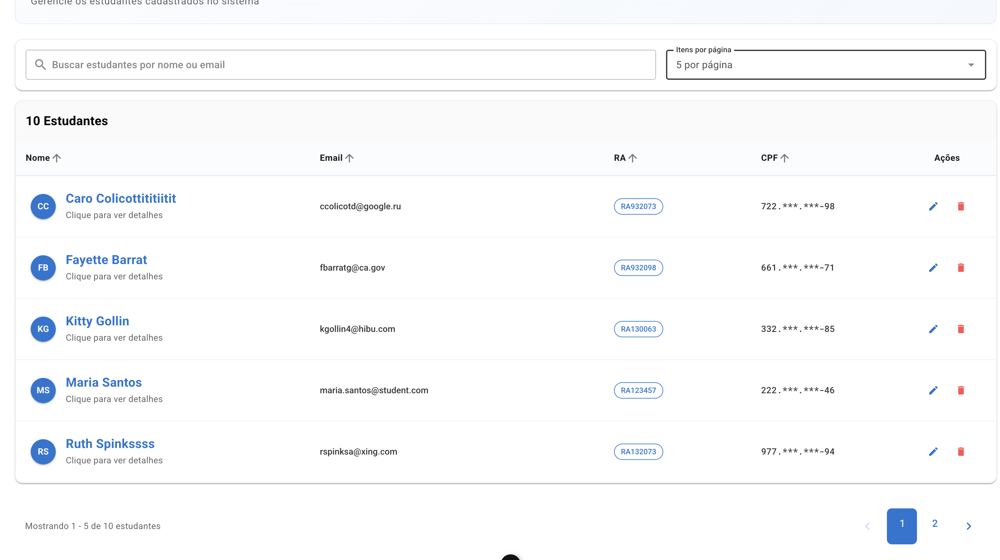

# Student Management Frontend - Documentação Técnica

## Decisão da Arquitetura Utilizada

### Arquitetura Baseada em Componentes (Component-Based Architecture)
O projeto frontend foi desenvolvido utilizando Vue.js 3 com Composition API, seguindo uma arquitetura moderna e escalável:

- **Views**: Páginas principais da aplicação (Login, Register, StudentList)
- **Components**: Componentes reutilizáveis organizados por funcionalidade
- **Services**: Camada de comunicação com APIs externas
- **Stores**: Gerenciamento de estado global usando Pinia
- **Composables**: Lógica reutilizável e reativa
- **Types**: Definições de tipos TypeScript para type safety
- **Validation**: Schemas de validação usando Zod
- **Utils**: Funções utilitárias reutilizáveis
- **Plugins**: Configurações de bibliotecas externas

### Padrões de Projeto Implementados

1. **Composition API Pattern**: Utilização da Composition API do Vue 3 para melhor organização e reutilização de código
2. **Store Pattern**: Gerenciamento de estado centralizado com Pinia
3. **Service Layer Pattern**: Abstração da camada de comunicação com APIs
4. **Component Composition**: Componentes modulares e reutilizáveis
5. **Reactive Programming**: Uso de reatividade do Vue para atualizações automáticas da UI

### Estrutura de Pastas
```
src/
├── components/          # Componentes reutilizáveis
│   └── student/        # Componentes específicos de estudantes
├── views/              # Páginas da aplicação
│   ├── auth/          # Páginas de autenticação
│   └── student/       # Páginas de estudantes
├── services/           # Camada de comunicação com APIs
├── stores/             # Gerenciamento de estado (Pinia)
├── composables/        # Lógica reutilizável
├── types/              # Definições de tipos TypeScript
├── validation/         # Schemas de validação
├── utils/              # Funções utilitárias
├── router/             # Configuração de rotas
├── plugins/            # Configurações de plugins
└── assets/             # Recursos estáticos
```

## Lista de Bibliotecas e Tecnologias Utilizadas

### Dependências de Produção

- **vue (^3.5.18)**: Framework JavaScript progressivo para construção de interfaces
- **vuetify (^3.10.2)**: Framework de componentes Material Design para Vue.js
- **vue-router (^4.5.1)**: Roteador oficial para Vue.js
- **pinia (^3.0.3)**: Store de estado oficial para Vue.js
- **axios (^1.12.2)**: Cliente HTTP para requisições à API
- **vee-validate (^4.15.1)**: Biblioteca de validação de formulários para Vue
- **zod (^3.25.76)**: Biblioteca de validação e parsing de schemas TypeScript-first
- **@mdi/font (^7.4.47)**: Ícones Material Design
- **@fontsource/roboto (^5.2.8)**: Fonte Roboto
- **@fontsource/roboto-mono (^5.2.8)**: Fonte Roboto Mono para elementos monospace

### Dependências de Desenvolvimento

- **typescript (~5.8.0)**: Superset tipado do JavaScript
- **vite (^7.0.6)**: Build tool e dev server rápido
- **@vitejs/plugin-vue (^6.0.1)**: Plugin Vite para Vue.js
- **vue-tsc (^3.0.4)**: Verificador de tipos TypeScript para Vue
- **vite-plugin-vuetify (^2.1.2)**: Plugin Vite para Vuetify
- **@types/node (^22.16.5)**: Definições de tipos para Node.js

## Fluxos e Funcionalidades da Aplicação

### 1. Fluxo de Autenticação

#### Tela de Login
- **Funcionalidade**: Autenticação de usuários existentes
- **Campos**: Email e senha
- **Validações**: 
  - Email válido
  - Senha obrigatória
- **Recursos**:
  - Toggle de visibilidade da senha
  - Link para página de registro
  - Feedback visual de erros
  - Loading state durante autenticação

  

#### Tela de Registro
- **Funcionalidade**: Cadastro de novos usuários
- **Campos**: Nome completo, email, senha e confirmação de senha
- **Validações**:
  - Nome obrigatório
  - Email único e válido
  - Senha com critérios de segurança
  - Confirmação de senha deve coincidir
- **Recursos**:
  - Toggle de visibilidade das senhas
  - Link para página de login
  - Validação em tempo real
  - Feedback visual de erros

    

### 2. Gerenciamento de Estudantes

#### Lista de Estudantes (Tela Principal)
- **Funcionalidade**: Visualização e gerenciamento de estudantes cadastrados
- **Recursos Principais**:
  - **Busca em Tempo Real**: Campo de pesquisa por nome ou email
  - **Paginação**: Controle de itens por página (5 ou 10)
  - **Ordenação**: Ordenação por nome, email, RA ou CPF
  - **Responsividade**: Layout adaptativo para desktop e mobile
  - **Estados Visuais**: Loading, erro e estado vazio

    

#### Funcionalidades por Tipo de Usuário

**Usuários Não Autenticados:**
- Visualização da lista de estudantes (somente leitura)
- Busca e filtros
- Visualização de detalhes dos estudantes
- Botão para fazer login

**Usuários Autenticados:**
- Todas as funcionalidades de usuários não autenticados
- Cadastro de novos estudantes
- Edição de estudantes existentes
- Exclusão de estudantes (com confirmação)
- Menu de usuário com opção de logout

### 3. Operações CRUD de Estudantes

#### Cadastro de Estudante
- **Modal**: "Cadastrar Novo Estudante"
- **Campos**: Nome completo, email, RA e CPF
- **Validações**:
  - Nome obrigatório
  - Email único e válido
  - RA único
  - CPF válido (validação algorítmica)
- **Recursos**:
  - Validação em tempo real
  - Feedback visual de erros
  - Botões de cancelar e cadastrar

      

#### Edição de Estudante
- **Modal**: "Editar Estudante"
- **Campos**: Nome completo e email (RA e CPF não editáveis)
- **Validações**:
  - Nome obrigatório
  - Email válido
- **Recursos**:
  - Pré-preenchimento dos campos
  - Aviso sobre campos não editáveis
  - Botões de cancelar e atualizar



#### Exclusão de Estudante
- **Modal**: "Confirmar Exclusão"
- **Funcionalidade**: Exclusão com confirmação dupla
- **Recursos**:
  - Exibição dos dados do estudante
  - Avatar com iniciais
  - Aviso sobre permanência da ação
  - Botões de cancelar e confirmar exclusão



#### Visualização de Detalhes
- **Modal**: Detalhes completos do estudante
- **Informações**: Nome, email, RA, CPF
- **Recursos**:
  - Avatar com iniciais
  - Formatação de dados
  - Opção de editar (se autenticado)


### 4. Funcionalidades de Interface

#### Sistema de Busca e Filtros
- **Busca Global**: Por nome ou email
- **Debounce**: Busca com delay para otimização
- **Indicador Visual**: Chip mostrando termo pesquisado
- **Limpeza Rápida**: Botão para limpar busca



#### Paginação e Ordenação
- **Paginação**: Navegação entre páginas
- **Itens por Página**: Seleção de 5 ou 10 itens
- **Ordenação**: Clique nos cabeçalhos da tabela
- **Indicadores**: Setas de ordenação ativas/inativas



#### Responsividade
- **Desktop**: Tabela completa com todas as colunas
- **Mobile**: Cards individuais com informações organizadas
- **Adaptação**: Layout se ajusta automaticamente ao tamanho da tela

#### Estados da Interface
- **Loading**: Indicador de carregamento
- **Erro**: Mensagens de erro com opção de retry
- **Estado Vazio**: Mensagens contextuais quando não há dados
- **Feedback**: Notificações de sucesso/erro para ações

### 5. Segurança e Privacidade

#### Proteção de Dados
- **Mascaramento de CPF**: Exibição parcial para segurança
- **Validação Client-Side**: Validações antes do envio
- **Sanitização**: Limpeza de dados de entrada

#### Controle de Acesso
- **Autenticação JWT**: Token armazenado de forma segura
- **Rotas Protegidas**: Redirecionamento para login quando necessário
- **Estados de Autenticação**: Interface adaptada ao status do usuário

## Tecnologias e Padrões de Design

### Material Design
- **Vuetify**: Implementação completa do Material Design
- **Componentes**: Uso consistente de componentes Material
- **Cores**: Paleta de cores seguindo guidelines do Material Design
- **Tipografia**: Hierarquia tipográfica bem definida

### Acessibilidade
- **ARIA Labels**: Rótulos para leitores de tela
- **Contraste**: Cores com contraste adequado
- **Navegação por Teclado**: Suporte completo
- **Feedback Visual**: Indicadores claros de estado

### Performance
- **Lazy Loading**: Carregamento sob demanda
- **Debounce**: Otimização de buscas
- **Paginação**: Carregamento incremental de dados
- **Caching**: Cache de requisições quando apropriado

## O que poderia ser melhorado com mais tempo

### Melhorias de UX/UI
- **Animações Avançadas**: Transições mais suaves entre estados
- **Skeleton Loading**: Loading states mais elaborados

### Funcionalidades Avançadas
- **Filtros Avançados**: Filtros por múltiplos campos
- **Exportação**: Export para CSV/PDF
- **Importação**: Import em lote de estudantes

### Performance e Otimização
- **Bundle Splitting**: Otimização do tamanho do bundle
- **Image Optimization**: Otimização de imagens e assets

### Testes
- **Testes Unitários**: Cobertura completa com Vitest
- **Testes E2E**: Testes end-to-end com Cypress
- **Visual Regression**: Testes de regressão visual

### Internacionalização
- **i18n**: Suporte a múltiplos idiomas
- **Formatação Regional**: Datas, números e moedas por região
- **RTL Support**: Suporte a idiomas da direita para esquerda

**Nota**: A aplicação atual já atende muito bem aos requisitos propostos, com uma interface moderna, responsiva e funcional. As melhorias sugeridas são incrementais e podem ser implementadas conforme a necessidade e prioridade do projeto e não se tornando um overkill.